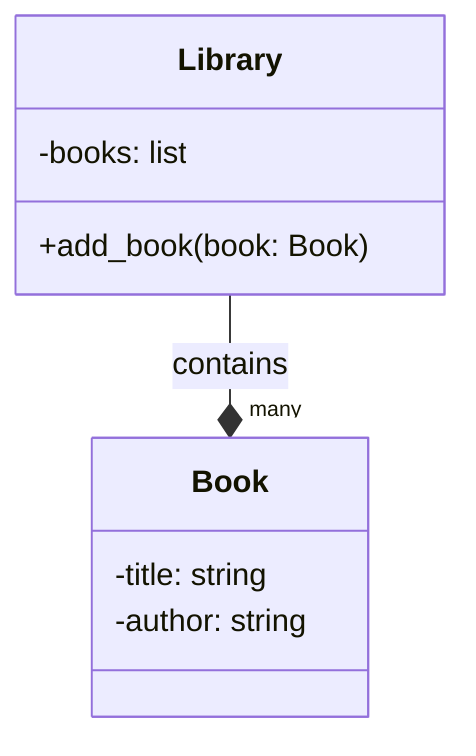
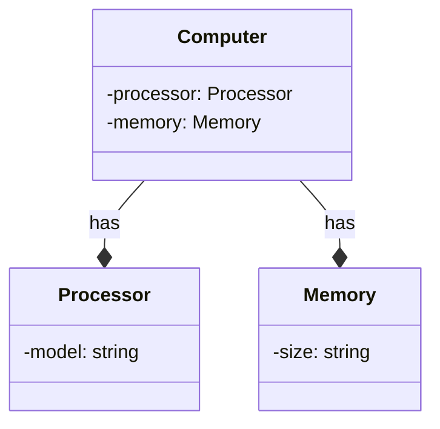
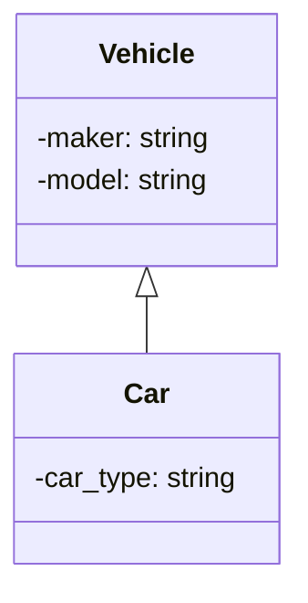
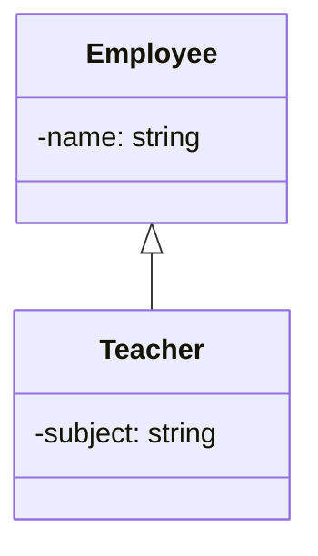
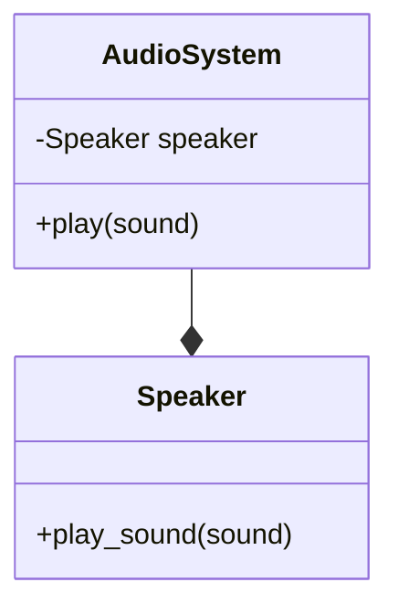
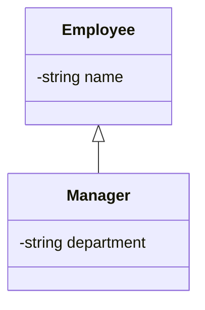
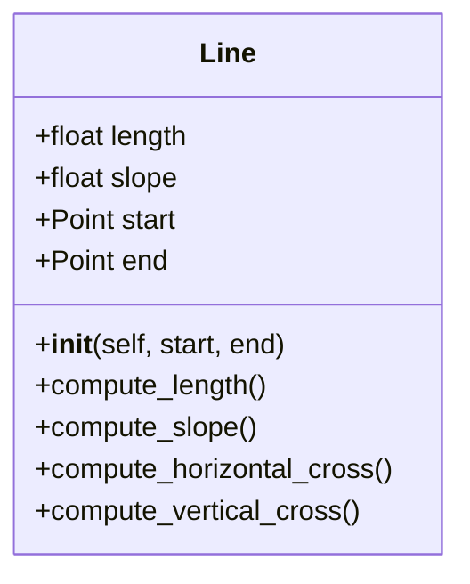

# Programación Orientada a Objetos - UNAL

## Clase 8: Composición vs Herencia

### Composición y Relaciones "Tiene Un"
La composición es un *principio de diseño* donde una clase incluye instancias de otras clases como parte de sus campos o propiedades, estableciendo una relación "tiene un". Esto significa que una clase compuesta *puede utilizar funcionalidades de las clases incluidas sin heredar de ellas directamente*.

**Ejemplo:** Sistema de Librería:
Una librería tiene un conjunto de libros.

```python
class Book:
    def __init__(self, title, author):
        self.title = title
        self.author = author

class Library:
    def __init__(self):
        self.books = []

    def add_book(self, book):
        self.books.append(book)
```




**Ejemplo:** Sistema de Computadora
Una computadora tiene un procesador y una memoria.

```python
class Processor:
    def __init__(self, model):
        self.model = model

class Memory:
    def __init__(self, size):
        self.size = size

class Computer:
    def __init__(self, processor, memory):
        self.processor = processor
        self.memory = memory
```



### Herencia y Relaciones "Es Un"
La herencia es un mecanismo que permite a una clase heredar(obtener) campos y métodos de otra clase. Establece una relación "es un", donde la clase derivada es una *especialización* (modificación) de la clase base.

**Ejemplo:** Vehículos:
Un coche es un tipo de vehículo.

```python
class Vehicle:
    def __init__(self, maker, model):
        self.maker = maker
        self.model = model

class Car(Vehicle):
    def __init__(self, maker, model, car_type):
        super().__init__(maker, model)
        self.car_type = car_type
```



**Ejemplo:** Empleados:
Un profesor es un tipo de empleado.

```python
class Employee:
    def __init__(self, name):
        self.name = name

class Teacher(Employee):
    def __init__(self, name, subject):
        super().__init__(name)
        self.subject = subject
```



### Comparación entre Herencia y Composición
- Herencia ("Es Un") se utiliza para modelar una relación jerárquica entre clases, donde una subclase es una versión especializada de la clase base. Promueve la reutilización de código pero puede llevar a jerarquías de clases complejas.

- Composición ("Tiene Un") se utiliza para modelar una relación donde una clase contiene una o varias instancias de otras clases como parte de sus estados. Favorece la flexibilidad y el encapsulamiento, facilitando la modificación de comportamientos y relaciones.


#### Cuándo Usar Composición sobre Herencia
Usa composición para construir clases complejas a partir de componentes simples y reutilizables, manteniendo una alta cohesión y un bajo acoplamiento, facilitando la modificación y extensión del código.

**Ejemplo de Composición:** Sistema de Audio:

```python

class Speaker:
    def play_sound(self, sound):
        print(f"Playing: {sound}")

class AudioSystem:
    def __init__(self):
        self.speaker = Speaker()

    def play(self, sound):
        self.speaker.play_sound(sound)
```



#### Cuándo Usar Herencia
Usa herencia para representar relaciones jerárquicas entre clases donde subclases comparten y extienden la funcionalidad de la superclase, promoviendo la reutilización de código.

**Ejemplo de Herencia:** Sistema de Empleados:

```python

class Employee:
    def __init__(self, name):
        self.name = name

class Manager(Employee):
    def __init__(self, name, department):
        super().__init__(name)
        self.department = department
```



**Ejercicio:**
1. Create class Line.

 - *length*, *slope*, start, end: Instance attributes, two of them being points (so a line is composed at least of two points).
 - compute_length(): should return the line´s length
 - compute_slope(): should return the slope of the line from tje horizontal in deg.
 - compute_horizontal_cross(): should return if exists the intersection with x-axis
 - compute_vertical_cross(): should return if exists the intersection with y-axis

2. Redefine the class Rectangle, adding a new method of initialization using 4 Lines (composition at its best, a rectangle is compose of 4 lines).

3. **Optional:** Define a method called discretize_line() that creates an array on *n* equally spaced points in the line and assigned as a instance attribute.

## Reto 3
Soon, so stay alert!


